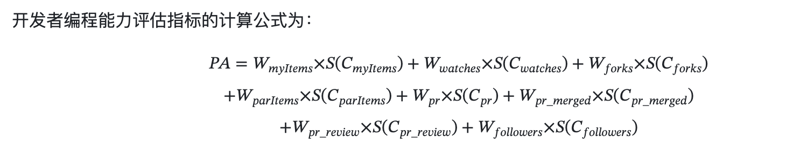
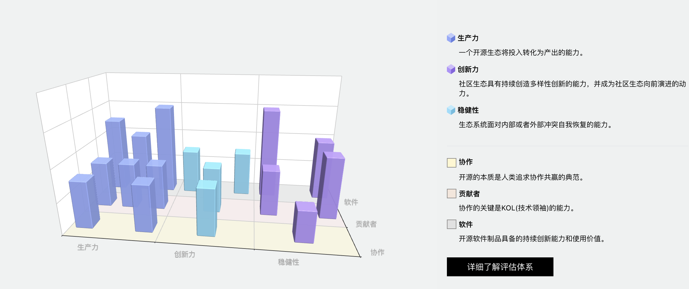
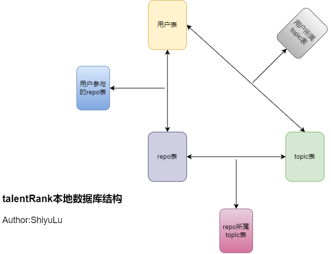

# 一、需求分析

## 题目描述

### 基础功能

- 对开发者的技术能力进行量化评级
  - 从开发者在一些主流领域中的热门开源项目的参与度入手，来量化每个开发者在不同领域下的技术能力评分。具体而言，首先我们会对主流领域中的热门开源项目进行一个评分，在量化开发者的参与程度后会将热门开源项目的分数按比例赋给开发者。
- 使用关系网络或其他算法猜测某个开发者的nation
  - 基于开发者followers和following的关系网络推测某个开发者的nation。但由于整个github用户构建的关系网络过于庞大，使用github API爬取有一定的请求limit，最终我们选择从开发者的location，company，github官网主页等信息入手，借助大语言模型llm去推测开发者的nation。
- 爬取数据来确定或推测开发者的领域。在查询的时候可以选定某个领域及Nation筛选相关的开发者，并可以按照tanlentRank排序。
  - 我们充分利用了Github API接口来爬取尽可能多的数据，并且存取了开发者参与过的项目及项目所属的topic标签等信息到了本地数据库中，并且设计了相关的查询接口来通过领域和Nation筛选开发者的TalentRank排名。

### 高级功能

- 置信度
  - 本项目中猜测的数据仅有开发者的Nation。在基础功能的第二点**使用关系网络或其他算法猜测某个开发者的nation**中我们提到了使用大语言模型llm来推测开发者的nation，推测的nation置信度。
- 评估信息自动整理
  - 对于开发者的个人信息，我们应用了大语言模型来对开发者繁多和种类不同的个人信息进行总结，最终结果将以一段文本的形式展示。

## 功能列表

- 搜索领域或者用户返回相应的开发者排名
  - 搜索领域（任意字符串）
    - 精确匹配（只能从指定的热门领域里选）
    - 模糊匹配（允许用户搜索字符串，将字符串进行nlp自然语言处理来解析字符串到不同的领域中）
  - 搜索用户（从本地数据库中存储用户的表中搜索）
  - 返回
    - 开发者，并且按照评分排序
    - 列表
      - 每一行：头像、id、nation、评分、置信度
      - 点击这一行则展开（或者弹出），显示评分理由
        - 该领域评分理由
        - 点击后显示该开发者所有领域的综合得分和理由
        - ai摘要（可选）
- 排行榜
  - 计算开发者所有领域分数之和的总榜

# 二、产品设计（架构设计）

## TalentRank量化标准

### 仓库价值计算公式

- 社区参与度（贡献者数量和用户反馈积极性，也就是open issues的数量）
- Star
- Fork

每个topic下爬取top10的仓库，随后保存全部仓库的信息至服务器的数据库。每个topic下社区参与度，Star，Fork各个维度都各有10分，这10个仓库根据每个维度占总和的比例分配这些分数。

$$Score_i = \sum_{dim}  \frac{dim_i}{\sum_{j=1}^{10}dim_j}  \\ dim \in \{open\_issues,star,fork\}$$

### 开发者能力计算公式

- 我们认为，开发者的能力与其参与热门开源项目的参与度密切相关。如果一个开发者在某个热门项目中的提交次数位于前10，那么这个开发者将以自己的提交次数除以前10个贡献者的提交次数之和的比例获得这个热门项目的分数。在进行开发者排名时，在选定几个特定的领域后，开发者能力计算公式为各个开发者在这几个特定领域下的热门项目中得到的分数。

### nlp分类用户搜索字符串的实现方案

- 调用字节大模型doubao-pro4k实现自然语言处理

### 大模型评估指标

大模型会给每个开发者进行评估，对关键指标进行打分，并给出评语。

#### 参考：

> - [GitHub - OS-HUBU/ProgrammingAbility: 开发者编程能力评估体系](https://github.com/OS-HUBU/ProgrammingAbility)
> - https://compass.gitee.com/analyze/sc2ktdvl
>   - https://compass.gitee.com/zh/blog/
>   - https://github.com/oss-compass
> - https://gitestimate.vercel.app/?username=XuMoheng
>   - https://github.com/taqui-786/GitEstimate
> - https://github.com/OS-HUBU/DevValSys?tab=docs/images-ov-file

## nation推测

开发者国家和地区的推断基于一个朴素的猜想：

1. 如果他在profile里写了nation，则采用profile的值；
2. 如果没写，那么看他项目的docs/images里是否使用了英语以外的语言（如中文、俄语）；
3. 如果仍不能判断nation，那么如果他关注的开发者与关注他的开发者里占多数的nation就是他的nation。

第3点中，如果他关注的开发者与关注他的开发者相同nation的人越多，那么置信度就越高。

但是实际开发中出现了一个比较严重的问题，就是爬取用户的follower和following需要消耗非常多的时间。获取follower的接口每次最多只能爬取100条数据，之后需逐个获取爬取下来的用户的nation，若数据库已有此用户，则直接读数据库，如果没有，就需要再一次逐个爬取用户主页，判断是否有location字段。用此方法推测一个有100个follower和following的用户的nation至少需要20分钟，这显然不太合适。

最后采用了一个可信度非常低的方法：让大模型分析github主页、博客、公司、个人资料、教育背景、项目描述、语言使用、时间记录等方面的信息，推测国籍。

## 网站后端

- 本地数据库架构图

  - 

  -  数据库将在服务器上部署。

  - topic表结构

  - | topicId | topicName |
    | ------- | --------- |
    |         |           |

  - repo表结构

  - githubuser表结构

  - | login        | id           | node_id           | avatar_url        | gravatar_id | url        | html_url            | followers_url | following_url    |
    | ------------ | ------------ | ----------------- | ----------------- | ----------- | ---------- | ------------------- | ------------- | ---------------- |
    | gists_url    | starred_url  | subscriptions_url | organizations_url | repos_url   | events_url | received_events_url | type          | user_view_type   |
    | site_admin   | name         | company           | blog              | location    | email      | hireable            | bio           | twitter_username |
    | public_repos | public_gists | followers         | following         | created_at  | updated_at |                     |               |                  |

- Springboot,Redis,MySQL架构
- 依据特定领域及Nation查询排序相关领域的开发者
  - 请求类型：Get
  - 请求参数：q(String), Nation(String)
- 点击某个开发者头像进入其github面板/能力值面板

## 网站前端

#### Flutter安卓端

- 热门topic接口
- 全部topic接口
- 根据topic返回相关用户的排名
- 用户详情接口

- Vue3,Flutter框架
- 暂时不需要做登录界面
- 需要做搜索框，及设计搜索出来一条一条的个人信息框，组件类似于ArcoDesign的List列表
  - 搜索框like👇
  - 
- 需要设计个人信息主页page

## Python和Java通信

对于在线搜索GitHub开发者或者领域，我们依然采用Python爬取数据。将python爬取的数据返回给Java可以使用http通信，也可以使用RPC。我们实现了让Python和Java通过grpc通信，但是在线搜索需要耗费较多的时间，最终这个功能并未上线。

## 前后端通信

- listTopic
  - url:http://1.95.59.208:8077/topic/listTopic?page=1&pageSize=16
  - params
    - page
    - pageSize
  - response

- rankByStaticTopic
  - url: http://1.95.59.208:8077/rank/rankByStaticTopic?page=1&pageSize=10&topicIds=1,2,3
  - params
    - page
    - pageSize
    - topicIds
    - nation

- rankBySearchString
  - url: http://1.95.59.208:8077/rank/rankBySearchString?page=1&pageSize=10&q=nlp and llm language applied in python field&nation=China
  - params
    - page
    - pageSize
    - q
    - nation

- localUserSearh
  - url: http://1.95.59.208:8077/user/aiSummary?html_url=https://github.com/justjavac%23gh-light-mode-only
  - params
    - page
    - pageSize
    - keyword
- htmlurl ai总结
  - url: http://1.95.59.208:8077/user/aiSummary?html_url=https://github.com/justjavac%23gh-light-mode-only
  - params
    - html_url

## 程序运行说明

将Springboot后端打包成jar包后部署在服务器上，同时记得配置好使用的所有服务的相关环境变量。

后端运行测试ip:1.95.59.208:8077

前端打包成apk后运行在自己的手机上，前端已经设置好与后端的对接通信。

## 团队分工

本项目的模块主要分为后端，算法，前端。本项目的主要分工如下：

徐谟横：负责Springboot后端及grpc的应用，python数据爬取。

陆诗雨：负责Springboot后端，数据库设计，python数据爬取及设计仓库价值计算公式和开发者能力计算公式以及相应数值计算的实现。

张泽毅：负责前后端联调，flutter前端开发及python数据爬取。

## 视频演示

<video src="./3b9050530a2012570f7a8b9c571c72e7.mp4" autoplay="false" controls="controls"></video>

**其他参考资料**

https://blogweb.cn/article/5515335031801